# Nén đặc trưng log-mel định hướng nhiệm vụ cho phân loại chữ số nói trên FSDD

*Tài liệu nguồn để viết báo cáo đề tài C3. Hình nằm trong `figures/` (cùng thư mục với file này).
Mọi số liệu lấy từ `results/summary/*.csv` và `results/hardware/*.csv` của project. Bảng chi tiết
(theo speaker, theo chữ số, theo fold × seed, từng run huấn luyện, thống kê latency đầy đủ…) nằm trong
**`PHU_LUC_SO_LIEU.md`** — sinh tự động từ dữ liệu bởi `src/make_report_appendix.py`; tham chiếu dạng
"Phụ lục A1", "Phụ lục D"… trỏ tới file đó.*

---

## 1. Mục tiêu và câu hỏi nghiên cứu

Một nút IoT thu âm, trích log-mel 64×32 và gửi cho gateway để phân loại chữ số 0–9. Gửi nguyên
log-mel FP32 tốn 8196 byte/mẫu. Đề tài nén đặc trưng thành **d byte INT8 (+4 byte header)** với
d ∈ {64, 128, 256}, và so sánh hai cách huấn luyện bộ nén:

* **AE-MSE**: autoencoder chỉ tối ưu tái tạo (MSE).
* **Task-AE**: cùng kiến trúc, tối ưu đồng thời tái tạo và phân loại qua một classifier đóng băng.

Câu hỏi nghiên cứu:

* **RQ1.** Ở cùng ngân sách byte, Task-AE có giữ accuracy tốt hơn AE-MSE và các baseline không học
  (DCT, Low-Mel) không?
* **RQ2.** Sai số tái tạo thấp hơn (MSE) có đồng nghĩa phân loại tốt hơn không?
* **RQ3.** Kết quả có giữ được với người nói chưa xuất hiện trong Train không (đánh giá LOSO)?
* **RQ4.** Encoder + lượng tử INT8 + đóng gói có chạy được trên ESP32-S3 không, với chi phí bao nhiêu?

## 2. Dữ liệu

FSDD, commit `26eb9aaf76e81b692f806f9140c2d2777410d7a1` (`v1.0.10-27-g26eb9aa`), tải ngày 2026-10-05.

| thuộc tính | giá trị |
|---|---|
| Số recording | 3000 |
| Người nói | 6 (george, jackson, lucas, nicolas, theo, yweweler) |
| Lớp | 10 (chữ số 0–9) |
| Cân bằng | 500 file/speaker, 300 file/digit, đúng 50 file mỗi cặp speaker × digit |
| Định dạng | WAV mono, 8000 Hz, PCM 16-bit |
| Thời lượng | trung bình 0.437 s (std 0.148), min 0.144 s, max 2.283 s |
| Kiểm tra | không có file hỏng, không trùng tên, không trùng nội dung (SHA-256), không label ngoài 0–9 |

Thời lượng khác nhau rõ giữa người nói: lucas dài nhất (TB 0.574 s), nicolas và yweweler ngắn nhất
(0.349 s, 0.354 s); theo chữ số, "0" và "9" dài nhất (0.504 s, 0.496 s), "2" ngắn nhất (0.384 s)
(Phụ lục A1–A2). Số mẫu/file: min 1148, median 3358, max 18262.

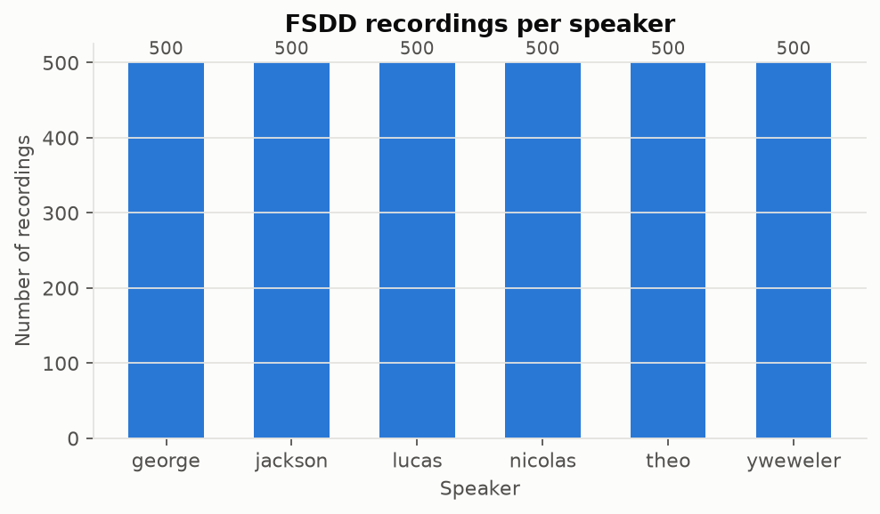
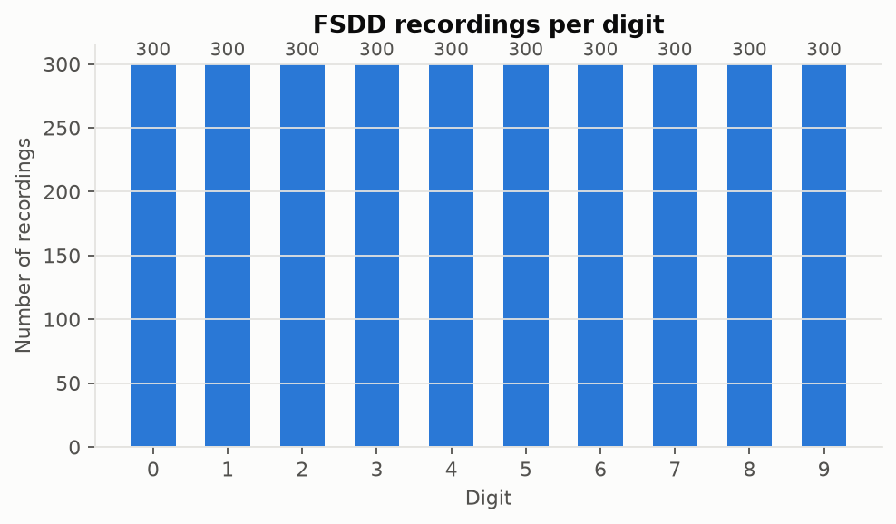
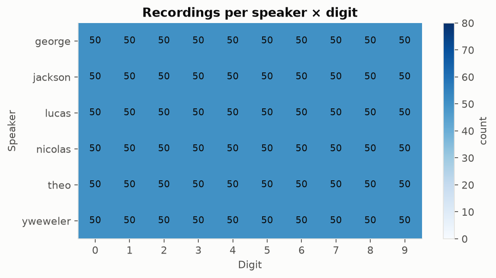
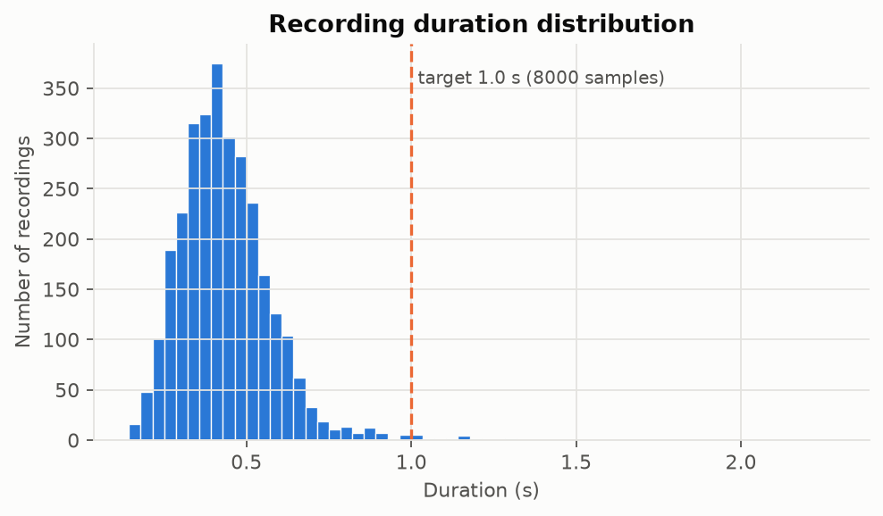
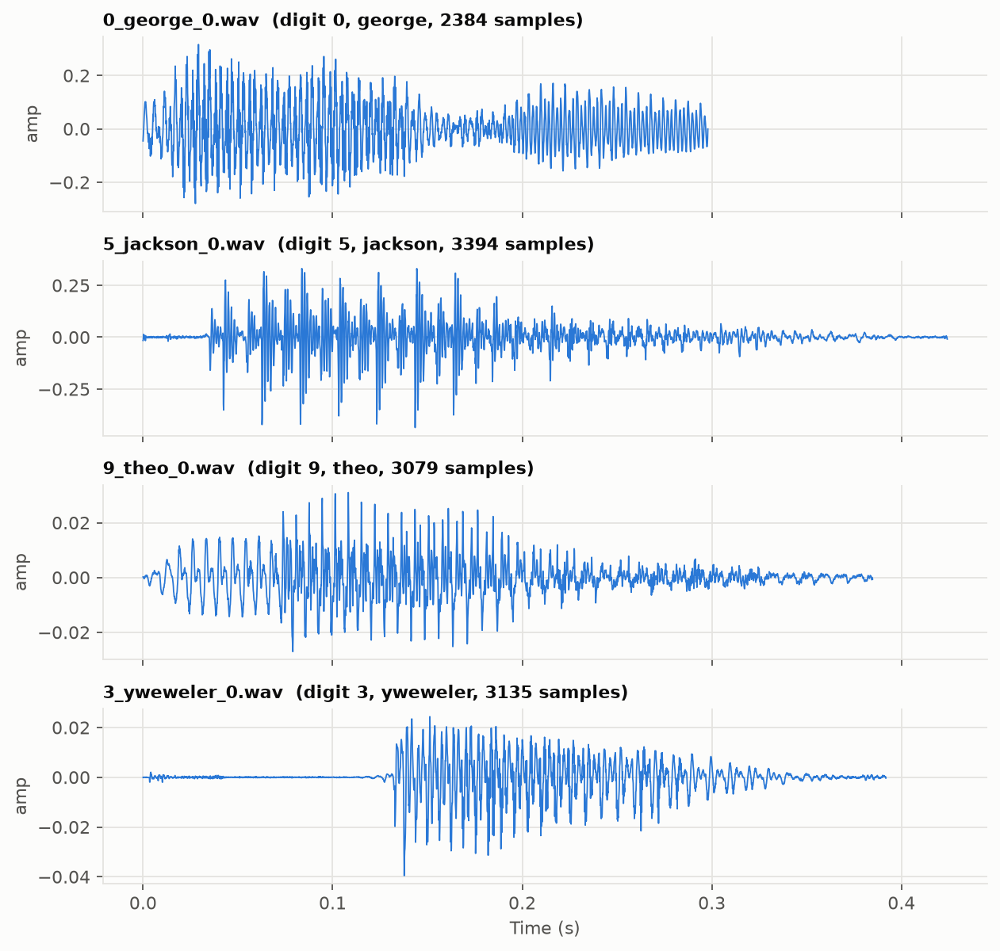

## 3. Tiền xử lý và đặc trưng

1. **Chuẩn hoá độ dài 1 s (8000 mẫu):** N < 8000 → pad 0 ở cuối (**2980 file**); N > 8000 → lấy 8000
   mẫu ở giữa, `start = (N−8000)//2` (**20 file**: lucas 16, theo 4); N = 8000: 0 file. Không resample.
   Sau khi chuẩn hoá, **56.4 %** tổng số mẫu audio là zero-padding (lời nói chiếm trung bình ~0.44 s
   trong khung 1 s).

   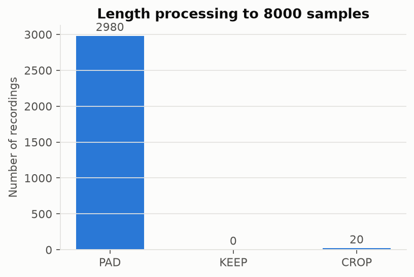
2. **Mel power:** STFT n_fft = win = hop = 256, Hann, center = True, pad 0; 64 mel (Slaney, 50–4000 Hz),
   power = 2 → P kích thước **64 × 32**.
3. **Log + CMVN theo recording:** `S = CMVN(log(P + 1e-6))`, CMVN = trừ trung bình, chia độ lệch chuẩn
   trên 64×32 giá trị của mỗi recording.
4. **Chuẩn hoá theo Train từng fold:** `x[f,t] = (S[f,t] − μ_f) / max(σ_f, 1e-6)`, μ_f, σ_f (64 giá trị)
   tính **chỉ trên Train** của fold, dùng lại cho Val/Test.

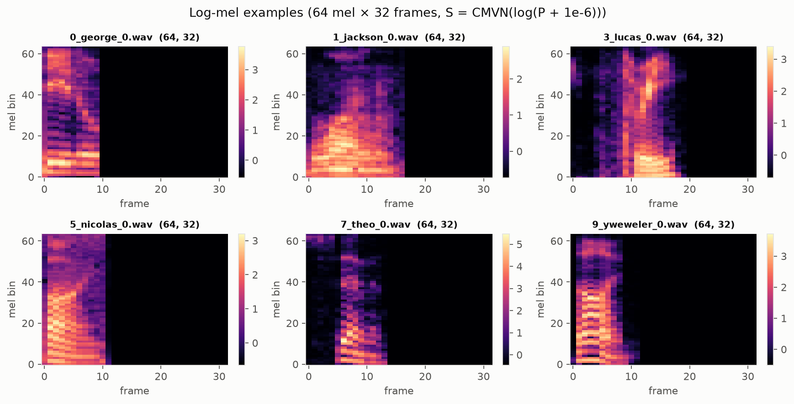

**Thay đổi so với đề cương (bước 3).** Đề cương quy định `S = log(1 + P)`. Vì audio float nằm trong
[−1, 1] nên P ≪ 1 và `log(1+P) ≈ P`: 95.3 % giá trị < 0.01, đặc trưng thực chất là power tuyến tính
và phụ thuộc âm lượng thu của từng speaker (trung bình S của jackson lớn gấp ~50 lần yweweler). Với
`log1p`, classifier LOSO chỉ đạt **21.8 %** (gần mức may rủi 10 %). Thử 7 biến thể trên cùng giao
thức (`results/logs/diagnostics/feature_variant_diagnostic.md`); chọn `CMVN(log(P+1e-6))` (quyết định
ngày 2026-10-05). Các tham số STFT/mel và kích thước 64×32 giữ nguyên.

| speaker | biên độ đỉnh median | TB log1p(P) | % giá trị log1p(P) < 0.01 | TB log(P+1e-6) | TB / std sau CMVN |
|---|---|---|---|---|---|
| george | 0.326 | 0.0065 | 94.0 | −11.51 | 0 / 1 |
| jackson | 0.430 | 0.0150 | 90.3 | −10.96 | 0 / 1 |
| lucas | 0.473 | 0.0090 | 93.6 | −11.63 | 0 / 1 |
| nicolas | 0.242 | 0.0040 | 95.4 | −11.85 | 0 / 1 |
| theo | 0.029 | 0.0007 | 99.4 | −12.95 | 0 / 1 |
| yweweler | 0.070 | 0.0003 | 99.4 | −12.90 | 0 / 1 |

theo và yweweler thu âm nhỏ hơn 5–15 lần (biên độ đỉnh 0.03–0.07 so với 0.24–0.47), nên với `log1p`
gần như toàn bộ đặc trưng ≈ 0. Kết quả chẩn đoán 8 biến thể: Phụ lục A5.

**Normalization theo Train (Phụ lục A4):** σ_f của Train nằm trong 0.43–1.54, μ_f trong −0.42…0.50;
sau chuẩn hoá Val/Test có trung bình −0.03…+0.02 và std 0.92–1.10 (Train: 0 / 1 theo định nghĩa).

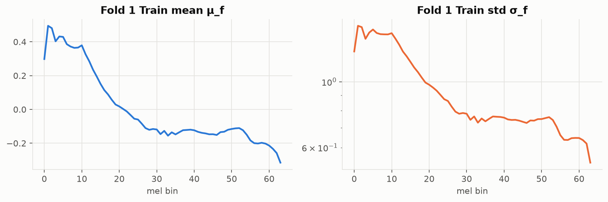

## 4. Giao thức đánh giá

* **6 lượt Leave-One-Speaker-Out.** Speaker sắp theo alphabet s1..s6; fold k: Test = s_k,
  Val = s_{k+1}, Train = 4 speaker còn lại (2000 / 500 / 500). Không speaker nào xuất hiện ở hai tập.
* **Không rò rỉ:** normalization chỉ từ Train; checkpoint chọn bằng Val; Test chỉ dùng để báo cáo.
* **Cùng điều kiện:** mọi phương pháp trong cùng fold/seed dùng cùng split và **cùng classifier đóng băng**.
* **Thí nghiệm chính (main, đã khoá):** seed 0 cho 6 fold × d ∈ {64,128,256}; thêm seed 1, 2 tại d = 128.

| fold | Test | Val | Train |
|---|---|---|---|
| 1 | george | jackson | lucas, nicolas, theo, yweweler |
| 2 | jackson | lucas | george, nicolas, theo, yweweler |
| 3 | lucas | nicolas | george, jackson, theo, yweweler |
| 4 | nicolas | theo | george, jackson, lucas, yweweler |
| 5 | theo | yweweler | george, jackson, lucas, nicolas |
| 6 | yweweler | george | jackson, lucas, nicolas, theo |

## 5. Phương pháp

### 5.1 Classifier tham chiếu (V1, đúng đề cương)

`Conv(1→32,k3,s2) → ReLU → Conv(32→64,k3,s2) → ReLU → Conv(64→128,k3,s2) → ReLU → GAP → Linear(128→10)`,
93 962 tham số, CrossEntropy, Adam lr 1e-3, weight decay 1e-4, batch 64, 60 epoch, chọn checkpoint
theo Val accuracy.

### 5.2 Baseline

| phương pháp | mô tả | byte |
|---|---|---|
| Original (FP32) | gửi nguyên x | 8196 |
| Direct INT8 | lượng tử toàn bộ x về INT8 (miền cố định ±8) | 2052 |
| DCT | DCT-II 2D (ortho), giữ d hệ số đầu theo zig-zag cố định, còn lại = 0, IDCT; hệ số gửi bằng INT8 với miền lượng tử riêng từng hệ số (fit trên Train, bảng cố định dùng chung node/gateway) | d + 4 |
| Low-Mel | giữ m = d/32 hàng mel thấp nhất (đủ 32 frame) dạng INT8, các hàng còn lại = 0 | d + 4 |

### 5.3 Codec (AE-MSE và Task-AE dùng chung kiến trúc)

* Encoder: `Conv(1→32,s2) → Conv(32→64,s2) → Conv(64→128,s2)` (ReLU) `→ Conv1×1(128→r) → tanh`,
  đầu ra r × 8 × 4, **d = 32r** (r = 2, 4, 8). ~93 k tham số.
* Decoder: `Conv1×1(r→128) → ConvT(128→64) → ConvT(64→32) → ConvT(32→1)` (k4, s2, p1, ReLU, đầu ra
  tuyến tính). ~165 k tham số. Không BatchNorm, không skip connection qua bottleneck.
* **Lượng tử INT8 latent:** `q = clip(round(127 z), −127, 127)`, `ẑ = q / 127`. Huấn luyện: fake
  quantization + Straight-Through Estimator; suy luận: tạo INT8 thật.
* **Packet:** header 4 byte (version u8, method_id u8, config_id u16 = d) + d byte INT8 → 68 / 132 / 260 byte.

**Độ phức tạp (Phụ lục B):**

| mô hình | tham số | MAC / mẫu | FP32 |
|---|---|---|---|
| Classifier V1 | 93 962 | 4.87 M | 375.8 kB |
| Encoder d = 64 / 128 / 256 | 92 930 / 93 188 / 93 704 | 4.87 / 4.88 / 4.90 M | 371.7 / 372.8 / 374.8 kB |
| Decoder d = 64 / 128 / 256 | 164 833 / 165 089 / 165 601 | 8.66 / 8.67 / 8.68 M | 659–662 kB |

Encoder (chạy ở node) chỉ chiếm ~36 % tham số và ~36 % MAC của codec; decoder nặng hơn nằm ở gateway.
Payload d byte tương ứng **0.25 / 0.5 / 1 bit trên mỗi giá trị log-mel** (so với 32 bit FP32, 8 bit INT8).

### 5.4 Hàm mất mát

* AE-MSE: `L = MSE(x, x̂)`.
* Task-AE: `L = MSE(x, x̂) + λ · CE(classifier(x̂), y)`; classifier ở `eval()`, `requires_grad = False`,
  **không** bọc `torch.no_grad()` để gradient CE truyền qua classifier về decoder/encoder.
  Lịch λ: epoch 1–20: 0; 21–40: tăng tuyến tính 0 → 1; 41–60: 1.
* Chọn checkpoint: AE-MSE theo Val MSE thấp nhất; Task-AE theo Val accuracy cao nhất trong các epoch λ = 1.
* Kiểm tra gradient: trên **toàn bộ 54 run Task-AE** của thí nghiệm chính, khi chỉ lan truyền CE, chuẩn
  gradient tại encoder nằm trong 0.019–1.653 (luôn > 0) và classifier nhận gradient ở 0/54 run.
* Thời gian huấn luyện (CPU, 1 luồng / run): codec 433–845 s / run; tổng 84 run codec ≈ 12.1 giờ-worker;
  18 classifier ≈ 26.5 phút.

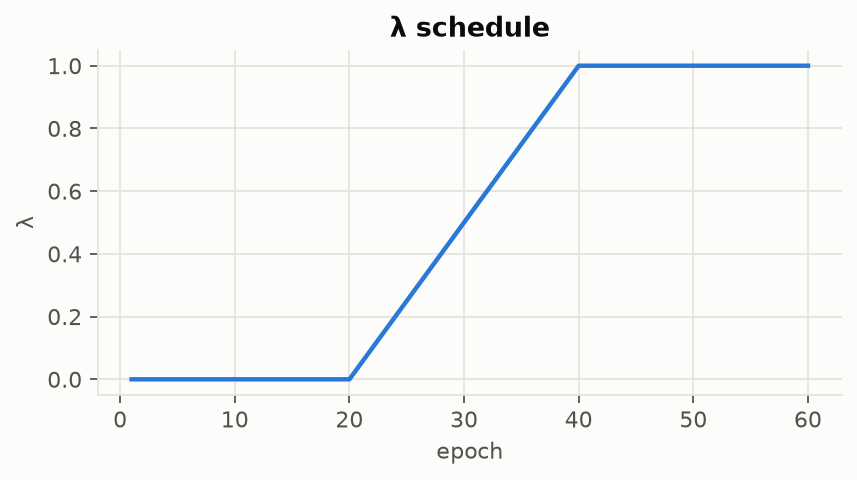

## 6. Metric

| metric | công thức | ý nghĩa | tốt khi | trả lời |
|---|---|---|---|---|
| Accuracy | số đúng / tổng số | tỷ lệ phân loại đúng; A0 trên log-mel gốc, Acomp sau nén–giải nén | cao | RQ1, RQ3 |
| Macro-F1 | trung bình F1 của 10 lớp | mỗi chữ số có trọng số như nhau; lộ ra lớp bị phân loại kém | cao | RQ1 |
| ΔA_pp | Acomp − A0 (điểm phần trăm) | nén làm mất bao nhiêu **điểm** phần trăm (không phải "%") | gần 0 | RQ1 |
| R_acc | 100 · Acomp / A0 | phần trăm khả năng phân loại được giữ lại | gần 100 % | RQ1 |
| MSE | mean((x − x̂)²) trên x đã chuẩn hoá | sai số tái tạo | thấp | RQ2 |
| PRD_spec | 100 · ‖S − Ŝ‖ / ‖S‖ trong miền S (trước chuẩn hoá Train) | sai số tương đối của biểu diễn log-mel — **không** phải chất lượng âm thanh | thấp | RQ2 |
| CR_INT8, CR_FP32 | 2052/(d+4), 8196/(d+4) | tỷ số nén **theo byte thực** (không dùng 2048/d) | cao | RQ1, RQ4 |

Byte: FP32 = 2048×4 + 4 = 8196; INT8 = 2048 + 4 = 2052; codec = d + 4.

## 7. Kết quả thí nghiệm chính (main, classifier V1)

### 7.1 Classifier tham chiếu A0

| test speaker | george | jackson | lucas | nicolas | theo | yweweler | trung bình |
|---|---|---|---|---|---|---|---|
| A0 (seed 0, %) | 51.4 | 56.2 | 24.0 | 27.0 | 43.8 | 51.6 | **42.3 ± 13.7** |

Seed 1: 44.5 %, seed 2: 45.7 % → trung bình 3 seed **44.2 %** (Macro-F1 0.397). Mức may rủi 10 %.
Theo speaker (3 seed): jackson 59.8 %, george 51.5 %, yweweler 51.0 %, theo 44.2 %, nicolas 33.0 %,
lucas 25.6 % (Phụ lục C1).

Audit (`results/logs/classifier_audit.log`): checkpoint Test là checkpoint Val-best, μ/σ đúng của
Train, nhãn khớp tên file, input [B,1,64,32], classifier ở eval → không có lỗi pipeline. Train accuracy
92–99 % ở 17/18 run (ngoại lệ: fold 3 seed 0 chọn checkpoint ở epoch 5, train 51.4 %), Test 24–62 %;
khoảng cách train − test trung bình **49.5 pp**. Cùng đặc trưng và classifier trên một phép chia
**phụ thuộc speaker** (chẩn đoán, ngoài giao thức) đạt 88 % → A0 thấp do **lệch miền giữa người nói**
và overfit, không phải lỗi.

**Theo chữ số** (gộp 18 run, Phụ lục C3): "8" dễ nhất (recall 0.604), "3" khó nhất (0.158). Cặp nhầm
nhiều nhất: 6→8 (23 %), 9→5 (23 %), 6→7 (19 %), 3→1 (17 %), 9→1 (17 %), 3→8 (17 %).

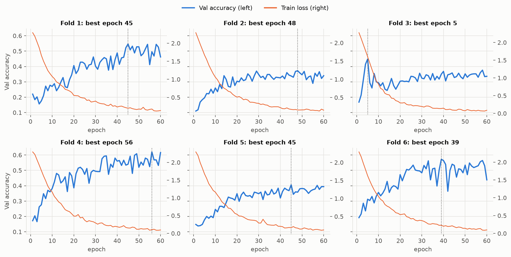
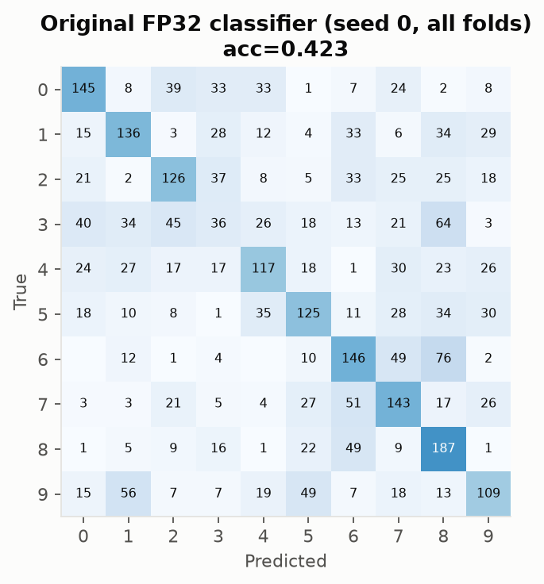

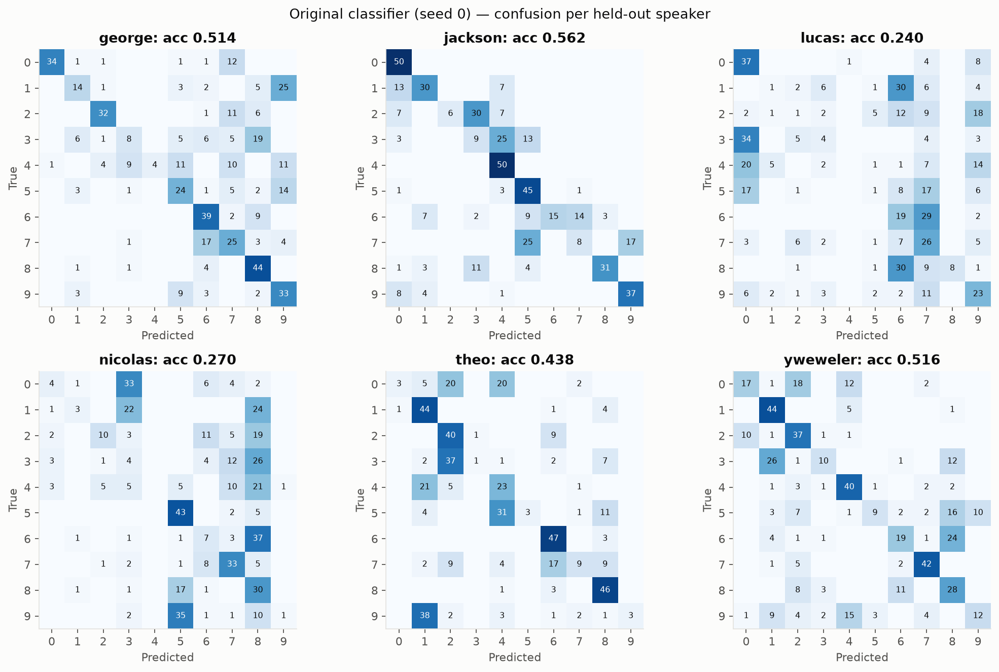

### 7.2 Bảng kết quả (Test, seed 0, trung bình ± std qua 6 fold)

| phương pháp | d | byte | CR_INT8 | Accuracy | Macro-F1 | ΔA_pp | R_acc (%) | MSE | PRD_spec (%) |
|---|---|---|---|---|---|---|---|---|---|
| Original | – | 8196 | 0.25 | 0.423 ± 0.137 | 0.373 | 0.0 | 100.0 | 0 | 0 |
| Direct INT8 | – | 2052 | 1.0 | 0.422 ± 0.138 | 0.372 | −0.1 | 99.7 | 0.0003 | 1.8 |
| **Task-AE** | 64 | 68 | 30.2 | **0.431 ± 0.141** | **0.388** | +0.8 | 103.3 | 0.173 | 38.0 |
| AE-MSE | 64 | 68 | 30.2 | 0.345 ± 0.122 | 0.292 | −7.9 | 80.7 | 0.106 | 29.5 |
| DCT | 64 | 68 | 30.2 | 0.318 ± 0.108 | 0.258 | −10.5 | 74.8 | 0.132 | 32.9 |
| Low-Mel | 64 | 68 | 30.2 | 0.100 ± 0.000 | 0.018 | −32.3 | 26.4 | 0.992 | 94.7 |
| **Task-AE** | 128 | 132 | 15.5 | **0.427 ± 0.147** | **0.388** | +0.4 | 100.3 | 0.124 | 31.9 |
| AE-MSE | 128 | 132 | 15.5 | 0.404 ± 0.134 | 0.359 | −1.9 | 95.1 | 0.068 | 23.8 |
| DCT | 128 | 132 | 15.5 | 0.391 ± 0.140 | 0.347 | −3.2 | 91.3 | 0.083 | 26.6 |
| Low-Mel | 128 | 132 | 15.5 | 0.102 ± 0.004 | 0.020 | −32.2 | 26.7 | 0.960 | 91.3 |
| **Task-AE** | 256 | 260 | 7.9 | **0.445 ± 0.144** | **0.406** | +2.2 | 105.4 | 0.111 | 30.7 |
| AE-MSE | 256 | 260 | 7.9 | 0.415 ± 0.143 | 0.368 | −0.8 | 97.3 | 0.047 | 20.1 |
| DCT | 256 | 260 | 7.9 | 0.416 ± 0.139 | 0.370 | −0.7 | 97.8 | 0.054 | 21.9 |
| Low-Mel | 256 | 260 | 7.9 | 0.106 ± 0.016 | 0.023 | −31.7 | 27.8 | 0.896 | 83.8 |

(CR_FP32 = 120.5 / 62.1 / 31.5 cho d = 64 / 128 / 256.)

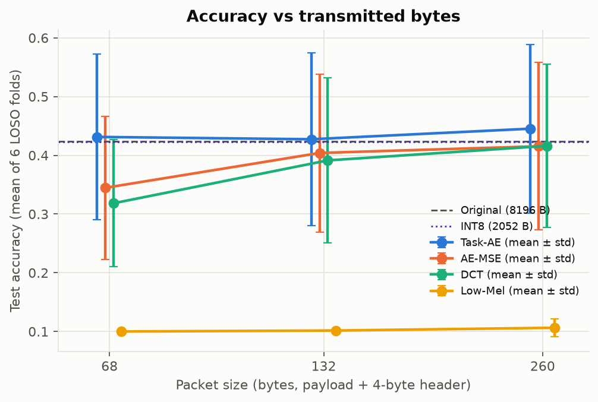
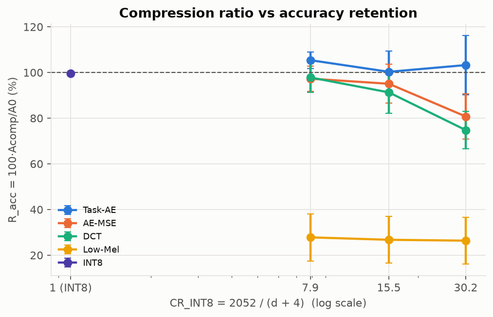

### 7.3 Task-AE so với AE-MSE (RQ1, RQ3)

* Theo speaker, seed 0: Task-AE tốt hơn AE-MSE ở **5/6 fold cho mỗi d** (Phụ lục D):

| d | gain TB (pp) | min … max (pp) | speaker dương | Wilcoxon p (n = 6) | paired t p |
|---|---|---|---|---|---|
| 64 | +8.67 | −0.2 … +18.6 | 5/6 | 0.0625 | 0.032 |
| 128 | +2.33 | −4.2 … +8.6 | 5/6 | 0.219 | 0.242 |
| 256 | +3.00 | −0.4 … +7.8 | 5/6 | 0.0625 | 0.049 |

  Mỗi dòng là một seed, 6 speaker; Wilcoxon không đạt 0.05 ở d nào (p nhỏ nhất có thể là 0.031).
* Multi-seed d = 128, **đơn vị suy luận là speaker** (trung bình 3 seed mỗi speaker → 6 cặp):

| speaker | george | jackson | lucas | nicolas | theo | yweweler | trung bình |
|---|---|---|---|---|---|---|---|
| AE-MSE (%) | 50.9 | 54.8 | 25.2 | 29.5 | 46.6 | 46.1 | 42.2 |
| Task-AE (%) | 50.2 | 60.7 | 27.5 | 31.3 | 46.9 | 51.6 | 44.7 |
| gain (pp) | −0.7 | +5.9 | +2.3 | +1.8 | +0.3 | +5.5 | **+2.53 ± 2.69** |

  Wilcoxon signed-rank chính xác hai phía (n = 6): **p = 0.094**; paired t-test: t(5) = 2.30,
  p = 0.069. **Chưa đạt mức ý nghĩa 0.05**; với 6 speaker, Wilcoxon chỉ có thể đạt p nhỏ nhất 0.031.
  → Xu hướng nhất quán (5/6 speaker), chưa phải khác biệt có ý nghĩa thống kê.
  Mô tả (không dùng để kiểm định vì 3 seed của cùng speaker không độc lập): Task-AE thắng 16/18 cặp
  (seed, speaker).
* Độ giữ accuracy của Task-AE: **không quan sát thấy suy giảm accuracy trung bình so với đặc trưng gốc;
  retention ≈ 101–105 %** (tỷ số các trung bình 101.9 / 100.9 / 105.2 % tại 68 / 132 / 260 B). Phần
  vượt 100 % nằm trong độ lệch chuẩn giữa fold; không diễn giải là nén "cải thiện thông tin" theo nghĩa
  tuyệt đối — khả năng hợp lý là hiệu ứng regularization/denoising đối với classifier cố định.

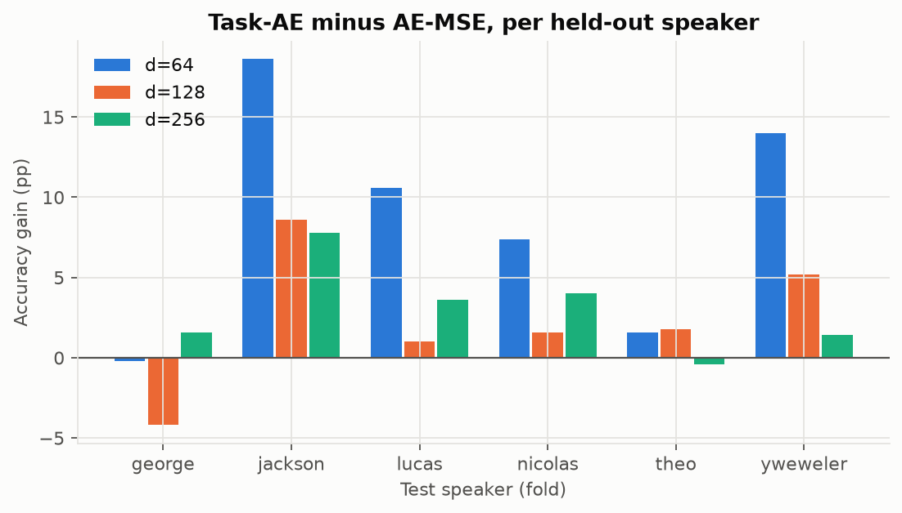
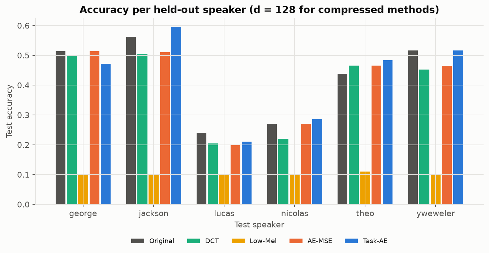

### 7.4 MSE và accuracy (RQ2)

Task-AE có MSE cao hơn AE-MSE ở **18/18** cặp (fold, d) và **vừa MSE cao hơn vừa accuracy cao hơn ở
15/18**. Trên toàn bộ 54 điểm (Task-AE, AE-MSE, DCT × 3 d × 6 fold), tương quan Spearman giữa MSE và
accuracy chỉ **ρ = −0.08**. Trong thiết lập này, MSE thấp hơn không đồng nghĩa phân loại tốt hơn — phù
hợp với giả thuyết nén định hướng nhiệm vụ. Mức chênh MSE trung bình (Task-AE so với AE-MSE): 0.173 vs
0.106 (d = 64), 0.124 vs 0.068 (128), 0.111 vs 0.047 (256); PRD_spec 38.0 vs 29.5, 31.9 vs 23.8,
30.7 vs 20.1 %.

Đường học (d = 128): khi λ bắt đầu tăng ở epoch 21, Val MSE của Task-AE nhảy lên rõ rệt rồi giảm dần,
trong khi Val accuracy biến động mạnh hơn; AE-MSE giảm MSE đơn điệu. Best epoch trung bình: AE-MSE 57.1,
Task-AE 47.9 (Phụ lục D).

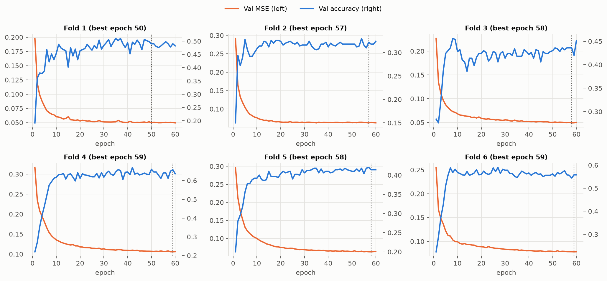
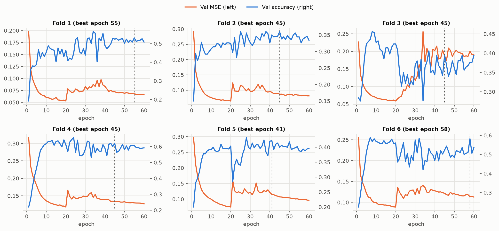

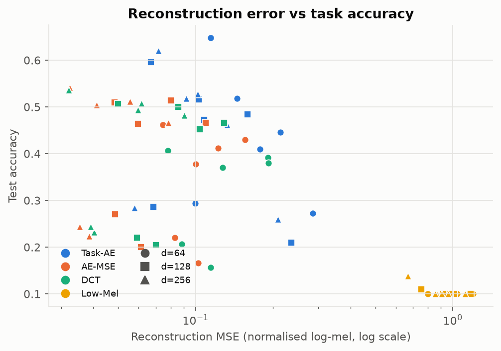
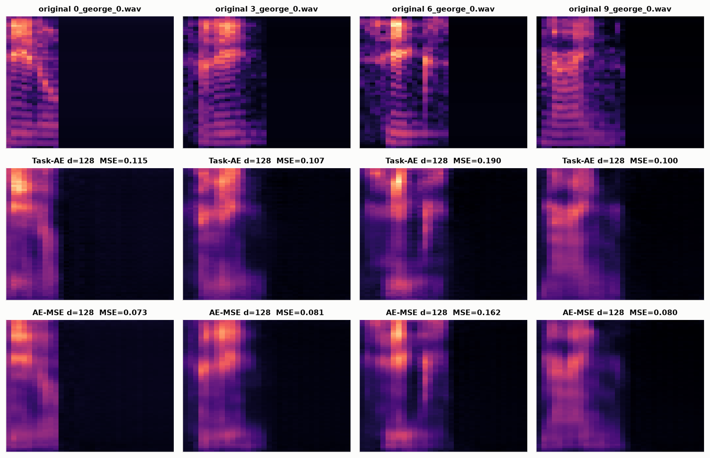
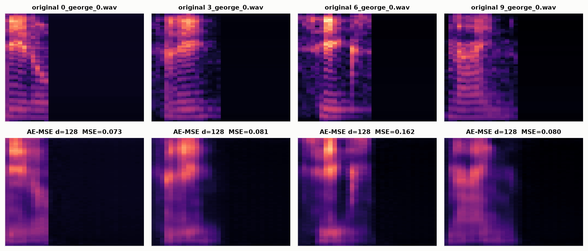

### 7.5 Baseline

* Direct INT8 gần như không mất accuracy (−0.1 pp) → lợi ích của codec đến từ giảm chiều, không phải từ INT8.
* DCT ngang AE-MSE ở d = 256, kém hơn rõ ở d = 64.
* **Low-Mel ≈ 10 % (mức may rủi)** ở mọi d: giữ 2/4/8 hàng mel thấp nhất và đặt phần còn lại = 0 khiến
  đầu vào lệch xa phân bố classifier đã học. Baseline giữ đúng định nghĩa đề cương, không chỉnh để làm
  đẹp số; kết quả cho thấy chỉ giữ vùng tần số thấp không đủ bảo toàn thông tin phân biệt cho classifier.

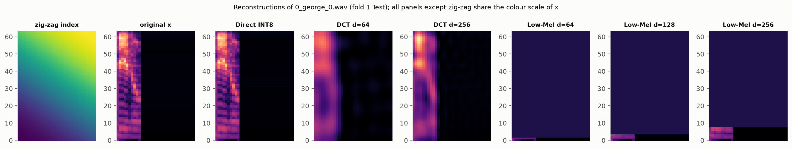
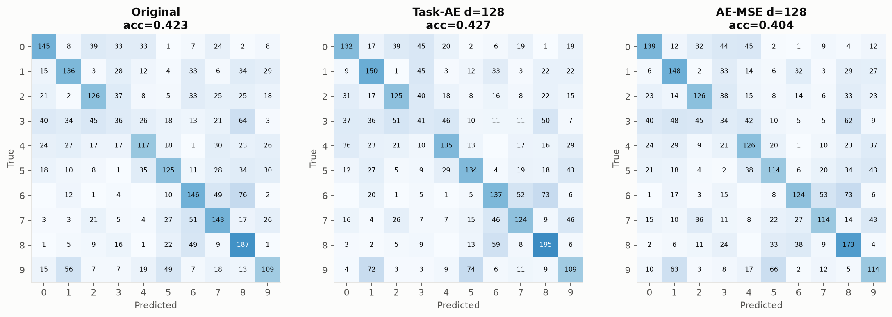

Confusion d = 128 (gộp 6 fold, seed 0): Task-AE nhận đúng nhiều hơn AE-MSE ở 7/10 chữ số (ví dụ "8":
195 vs 173, "6": 137 vs 124, "4": 135 vs 126); cả hai giữ nguyên các cặp nhầm của classifier gốc
(6→8, 9→1/9→5).

### 7.6 Ablation λ (d = 128, seed 0)

* **Validation:** λ_max = 0 / 0.1 / 0.5 / 1 / 2 → Val accuracy 0.496 / 0.491 / 0.494 / 0.485 / 0.483;
  Val MSE tăng đơn điệu 0.074 → 0.147. Val không phân biệt rõ các λ; do Val đồng thời được dùng để chọn
  checkpoint, kết quả này chỉ mang tính thăm dò.
* **Test (phân tích hậu kiểm, không dùng để chọn λ; λ = 1 cố định từ đề cương):** λ = 0: 0.396,
  0.1: 0.417, 0.5: 0.442, 1: 0.427, 2: 0.435; AE-MSE 0.404. Trên Test, λ = 0 thấp hơn rõ so với
  λ ≥ 0.5, phù hợp với giả thuyết rằng classification loss đóng góp vào việc bảo toàn nhiệm vụ
  (seed 0, 6 fold, chưa kiểm định thống kê).
* Val MSE / PRD_spec tăng đơn điệu theo λ: 0.074 / 25.0 % (λ = 0) → 0.079 / 25.8 → 0.103 / 29.7 →
  0.117 / 31.6 → 0.147 / 35.5 % (λ = 2) — λ lớn hơn đổi tái tạo lấy phân loại. Chi tiết theo fold:
  Phụ lục D.

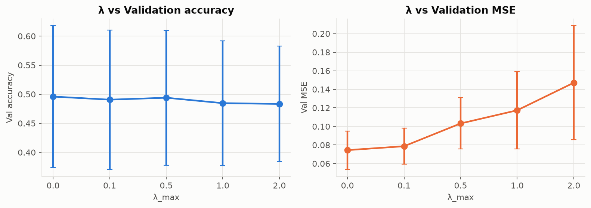

### 7.7 Byte stream thực

Node ghi một file `.bin` cho mỗi recording; một tiến trình gateway khác chỉ đọc các file `.bin`,
parse header, giải lượng tử, decode và phân loại: **500/500 packet đúng 132 byte**, prediction trùng
100 % với pipeline tham chiếu. Mọi kết quả AE-MSE/Task-AE ở trên đều đi qua đường encoder → INT8 →
bytes → parse → decoder.

## 8. Thí nghiệm mở rộng (follow-up, hậu kiểm): classifier V2

> Thực hiện **sau khi** thí nghiệm chính đã được đánh giá trên Test → báo cáo là *follow-up*, không thay
> thế kết quả chính. Giữ nguyên 6 fold LOSO, tiền xử lý 64×32, normalization theo Train. Cấu hình
> classifier chỉ được chọn bằng Train + Val; Test chỉ mở sau khi đã khoá cấu hình. Codec được huấn
> luyện lại trên classifier V2.

### 8.1 Tìm cấu hình classifier V2 (chỉ Validation)

* Augmentation **chỉ trên Train**: speed perturbation (0.9/0.95/1.05/1.1, resample) + nhiễu trắng
  SNR 20–40 dB ở mức waveform (4 bản sao/recording, cùng pipeline đặc trưng); SpecAugment (1 mặt nạ tần
  số ≤ 8 bin, 1 mặt nạ thời gian ≤ 4 frame), dịch thời gian ±3 frame, nhiễu Gauss σ = 0.1 trên đặc
  trưng. Không dùng random gain vì CMVN triệt tiêu nó.
* Kiến trúc: giữ 3 conv + GAP + linear như V1 (93 962 tham số), thay stride lớp 1 thành (2,1) để giữ
  độ phân giải thời gian (`t1`), dropout 0.3 trước lớp linear.
* 14 cấu hình × 6 fold, xếp theo Val accuracy trung bình; quy tắc khoá: cao nhất.

| cấu hình | Val acc trung bình |
|---|---|
| V1 đề cương (A1) | 0.489 |
| + dropout + SpecAugment (A2) | 0.533 |
| + speed perturbation (A6) | 0.606 |
| t1 + dropout + SpecAugment + speed, 100 epoch (A5) | 0.633 |
| **t1 + dropout 0.3 + SpecAugment + speed, 200 epoch, early stop 40 (B5, khoá)** | **0.675** |

Val này lạc quan (Val vừa chọn checkpoint vừa chọn cấu hình trong 14 ứng viên).

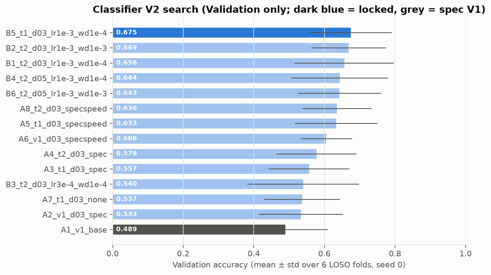

### 8.2 A0 với classifier V2 (Test)

| test speaker | george | jackson | lucas | nicolas | theo | yweweler | trung bình |
|---|---|---|---|---|---|---|---|
| A0 V1, seed 0 (%) | 51.4 | 56.2 | 24.0 | 27.0 | 43.8 | 51.6 | 42.3 |
| A0 V2, seed 0 (%) | 40.6 | 77.0 | 74.0 | 46.0 | 52.2 | 75.8 | 60.9 |
| **A0 V2, trung bình 3 seed (%)** | 40.3 | 73.4 | 52.2 | 40.7 | 51.1 | 73.9 | **55.3** |

| | seed 0 | seed 1 | seed 2 | trung bình |
|---|---|---|---|---|
| A0 V1 (%) | 42.3 | 44.5 | 45.7 | 44.2 |
| A0 V2 (%) | 60.9 | 53.3 | 51.6 | **55.3** |

A0 tăng ≈ **+11 pp** (trung bình 3 seed: 44.2 → 55.3 %). Seed 0 của V2 là seed tốt nhất (lucas:
74.0 % ở seed 0 nhưng 42.6 % / 40.0 % ở seed 1 / 2) → V2 nhạy với seed; con số đại diện là trung bình
3 seed, không phải 60.9 %. george là speaker duy nhất giảm so với V1.

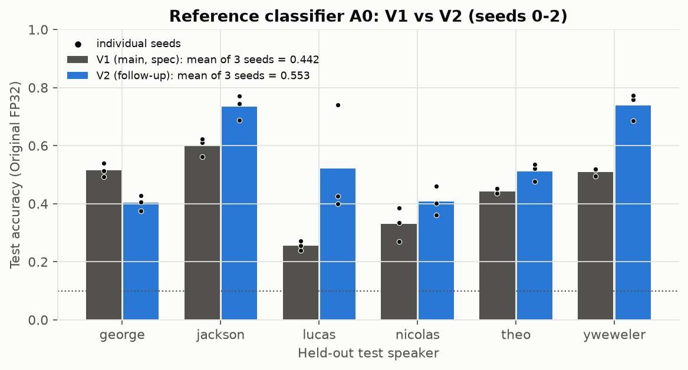

### 8.3 Codec trên classifier V2 — seed 0, 6 fold, d ∈ {64, 128, 256}

| phương pháp | d | byte | Accuracy | Macro-F1 | ΔA_pp | R_acc (%) | MSE | PRD_spec (%) |
|---|---|---|---|---|---|---|---|---|
| Original | – | 8196 | 0.609 ± 0.165 | 0.581 | 0.0 | 100.0 | 0 | 0 |
| Direct INT8 | – | 2052 | 0.607 ± 0.166 | 0.578 | −0.2 | 99.5 | 0.0003 | 1.8 |
| **Task-AE** | 64 | 68 | **0.536 ± 0.189** | **0.509** | −7.4 | 87.0 | 0.141 | 34.2 |
| AE-MSE | 64 | 68 | 0.479 ± 0.087 | 0.454 | −13.1 | 81.9 | 0.106 | 29.5 |
| DCT | 64 | 68 | 0.409 ± 0.103 | 0.357 | −20.1 | 71.3 | 0.132 | 32.9 |
| Low-Mel | 64 | 68 | 0.100 ± 0.001 | 0.021 | −51.0 | 17.5 | 0.992 | 94.7 |
| Task-AE | 128 | 132 | 0.532 ± 0.177 | 0.499 | −7.7 | 87.1 | 0.105 | 29.6 |
| **AE-MSE** | 128 | 132 | **0.543 ± 0.134** | **0.518** | −6.6 | 90.1 | 0.068 | 23.8 |
| DCT | 128 | 132 | 0.519 ± 0.136 | 0.500 | −9.0 | 86.8 | 0.083 | 26.6 |
| Low-Mel | 128 | 132 | 0.103 ± 0.007 | 0.029 | −50.6 | 18.1 | 0.960 | 91.3 |
| **Task-AE** | 256 | 260 | **0.603 ± 0.157** | **0.583** | −0.6 | 99.5 | 0.073 | 24.9 |
| AE-MSE | 256 | 260 | 0.579 ± 0.170 | 0.554 | −3.1 | 94.6 | 0.047 | 20.1 |
| DCT | 256 | 260 | 0.582 ± 0.167 | 0.564 | −2.7 | 95.5 | 0.054 | 21.9 |
| Low-Mel | 256 | 260 | 0.139 ± 0.025 | 0.073 | −47.0 | 24.3 | 0.896 | 83.8 |

Task-AE − AE-MSE theo speaker (seed 0): d = 64: +5.7 pp (3/6 speaker dương, dao động −11.8 … +32.6);
d = 128: −1.1 pp (3/6); d = 256: +2.5 pp (4/6). MSE vs accuracy: Task-AE có MSE cao hơn AE-MSE ở 18/18
cặp (fold, d) và vừa MSE cao hơn vừa accuracy cao hơn ở 10/18 (main: 15/18).

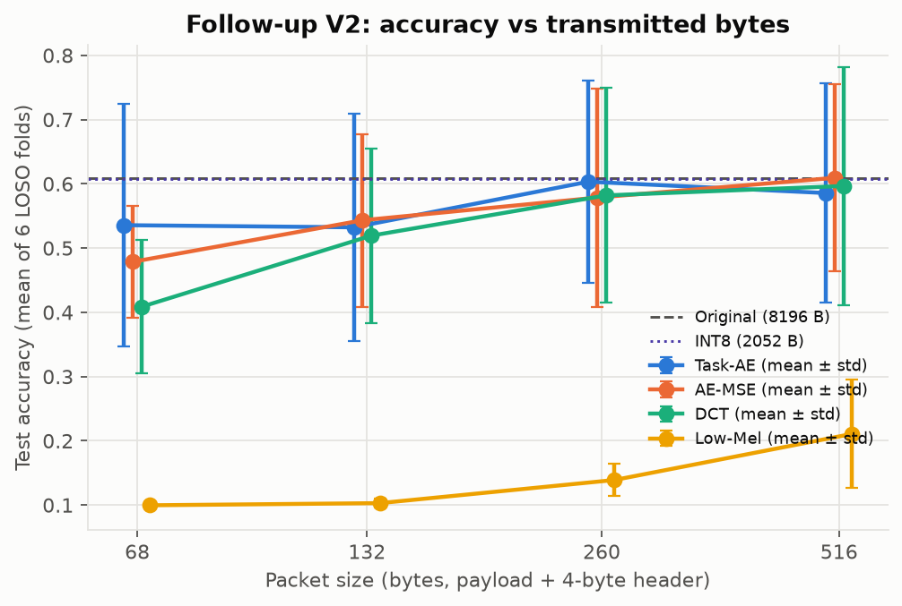
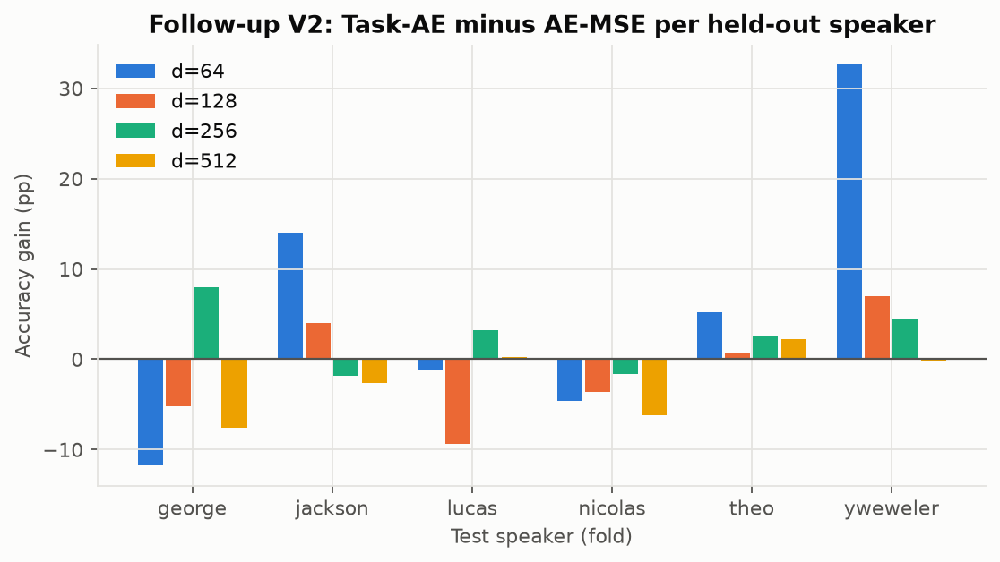

### 8.4 Multi-seed d = 128 trên V2 (seeds 0, 1, 2)

| | seed 0 | seed 1 | seed 2 | trung bình |
|---|---|---|---|---|
| Original (%) | 60.9 | 53.3 | 51.6 | 55.3 |
| Task-AE (%) | 53.2 | 52.9 | 50.2 | **52.1** |
| AE-MSE (%) | 54.3 | 48.8 | 46.2 | 49.8 |
| DCT (%) | 51.9 | 45.0 | 45.9 | 47.6 |

Đơn vị suy luận là speaker (trung bình 3 seed → 6 cặp):

| speaker | george | jackson | lucas | nicolas | theo | yweweler | trung bình |
|---|---|---|---|---|---|---|---|
| AE-MSE (%) | 38.1 | 65.0 | 40.5 | 35.9 | 52.7 | 66.4 | 49.8 |
| Task-AE (%) | 37.9 | 70.5 | 41.8 | 39.1 | 53.8 | 69.7 | 52.1 |
| gain (pp) | −0.2 | +5.5 | +1.3 | +3.2 | +1.1 | +3.3 | **+2.37 ± 2.01** |

Task-AE cao hơn ở 5/6 speaker. Wilcoxon signed-rank chính xác hai phía (n = 6): **p = 0.0625**;
paired t-test: t(5) = 2.88, p = 0.035 (giả định chuẩn, n nhỏ). Kết luận thận trọng: xu hướng nhất quán,
kiểm định phi tham số chưa đạt 0.05. Mô tả: Task-AE thắng 13/18 cặp (seed, speaker). R_acc trung bình
3 seed: Task-AE 95.2 %, AE-MSE 90.1 %.

### 8.5 Nhận xét follow-up

* Classifier tốt hơn (A0 +11 pp) làm mọi codec mất accuracy nhiều hơn ở 68–132 B (R_acc ≈ 82–90 %);
  ở 260 B Task-AE gần như không mất (R_acc 99.5 %, seed 0).
* Với **3 seed**, ưu thế Task-AE so với AE-MSE ở d = 128 (+2.37 pp, 5/6 speaker) **tương tự thí nghiệm
  chính** (+2.53 pp, 5/6 speaker). Kết quả riêng seed 0 (Task-AE thấp hơn 1.1 pp) là một seed bất lợi —
  cho thấy kết luận từ một seed dễ sai lệch.
* Trên V2, lợi thế theo speaker kém đồng đều hơn thí nghiệm chính (seed 0: 3–4/6 speaker so với 5/6),
  và khoảng cách Val–Test của Task-AE lớn hơn AE-MSE.
* Kiểm định theo speaker cho từng d (seed 0, Phụ lục E): d = 64: +5.7 pp, Wilcoxon p = 0.56; d = 128:
  −1.1 pp, p = 0.84; d = 256: +2.5 pp, p = 0.16; d = 512: −2.4 pp, p = 0.25 — không d nào có ý nghĩa.
* Tương quan Spearman MSE–accuracy trên V2 là ρ = −0.44 (main: −0.08): với classifier mạnh hơn, tái tạo
  tốt hơn liên quan rõ hơn tới phân loại tốt hơn — giải thích vì sao lợi thế riêng của Task-AE nhỏ đi.
* Classifier V2: train − test trung bình 35.1 pp (V1: 49.5 pp); theo chữ số, "2" cải thiện mạnh nhất
  (recall 0.422 → 0.788); khó nhất là "9" (0.381) và "3" (0.406); "5" giảm (0.533 → 0.451) (Phụ lục C3).

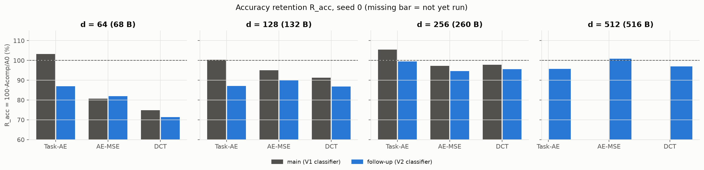

### 8.6 Mở rộng trên V2 (seed 0, 6 fold)

**(a) d = 512 (packet 516 B, CR_INT8 = 3.98, CR_FP32 = 15.9)**

| phương pháp | Accuracy | R_acc (%) | MSE |
|---|---|---|---|
| **AE-MSE** | **0.609** | 100.9 | 0.033 |
| DCT | 0.597 | 96.9 | 0.029 |
| Task-AE | 0.586 | 95.7 | 0.070 |
| Low-Mel | 0.211 | 36.3 | 0.771 |

Ở d = 512, **AE-MSE tốt hơn Task-AE** (−2.3 pp; Task-AE chỉ hơn ở 2/6 speaker: lucas, theo). Cùng với
d = 64 (+5.7 pp) và d = 256 (+2.5 pp), xu hướng là lợi ích của classification loss lớn nhất khi ngân sách
byte nhỏ và biến mất khi ngân sách đủ lớn để tái tạo giữ gần đủ thông tin cho classifier.

**(b) Chọn λ theo Validation từng fold** (λ_max ∈ {0.1, 0.5, 1, 2}; chọn Val accuracy cao nhất, hoà →
λ = 1; khoá rồi mới đo Test một lần):

| test speaker | george | jackson | lucas | nicolas | theo | yweweler | trung bình |
|---|---|---|---|---|---|---|---|
| λ chọn trên Val | 0.5 | 1 | 0.1 | 2 | 1 | 2 | |
| Test, λ chọn (%) | 25.8 | 76.0 | 59.6 | 38.0 | 52.8 | 72.6 | **54.1** |
| Test, λ = 1 cố định (%) | 35.8 | 76.0 | 48.8 | 34.0 | 52.8 | 72.0 | 53.2 |

Khác biệt Val giữa các λ rất nhỏ (thường < 3 pp) nên lựa chọn không ổn định; trung bình Test chỉ +0.9 pp
và đổi chiều theo speaker (george −10.0, lucas +10.8). Không có bằng chứng rằng chọn λ theo Val tốt hơn
λ = 1 cố định.

**(c) Lịch λ chậm** (λ = 0 ở epoch 1–30, tăng tuyến tính 31–60, = 1 đến epoch 90) so với lịch đề cương
(20 / 40 / 60), λ_max = 1:

| lịch | Val acc | Val MSE | Test acc | Test MSE |
|---|---|---|---|---|
| đề cương 20/40/60 | 0.649 | 0.102 | 0.532 | 0.105 |
| chậm 30/60/90 | 0.631 | 0.090 | **0.572** | **0.088** |

Theo fold (Test, %): 35.8→36.8, 76.0→76.0, 48.8→59.8, 34.0→39.0, 52.8→56.8, 72.0→75.0 — lịch chậm
cao hơn hoặc bằng ở 6/6 fold (+4.0 pp trung bình) và MSE thấp hơn. Lưu ý: (i) **Val chọn lịch đề cương**
(0.649 > 0.631), nên lịch chậm không thể được chọn theo đúng quy tắc — đây chỉ là phân tích hậu kiểm;
(ii) lịch chậm có 90 epoch so với 60 epoch của AE-MSE và lịch đề cương, nên khác biệt có thể một phần do
huấn luyện lâu hơn. Phù hợp với giả thuyết rằng encoder học biểu diễn tái tạo ổn định trước khi CE chi
phối thì tổng quát sang speaker mới tốt hơn; cần thêm seed để khẳng định.

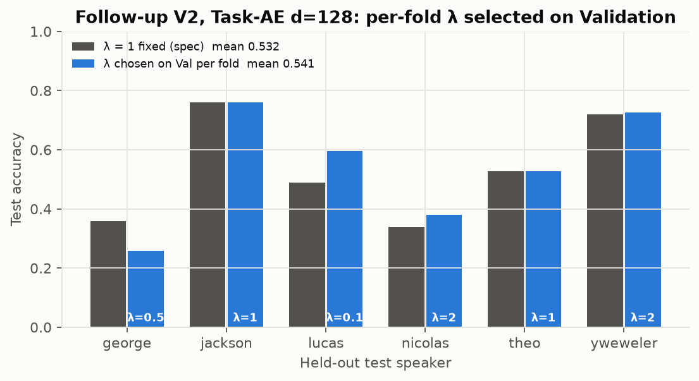
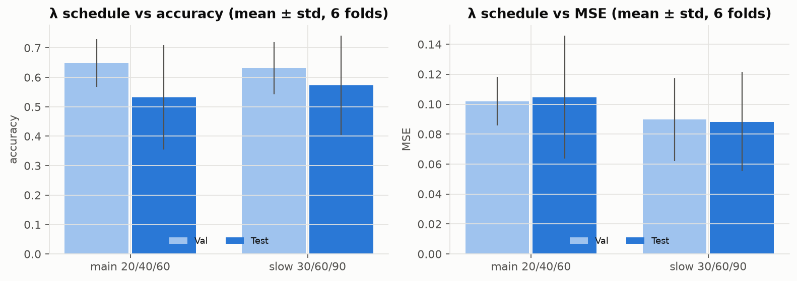

## 9. Triển khai ESP32-S3 (RQ4)

**Nền tảng huấn luyện:** CPU (PC, PyTorch). **Nền tảng triển khai:** ESP32-S3 (chỉ suy luận).
Node: [tiền xử lý →] encoder → INT8 → packet; gateway (PC): parse → giải lượng tử → decoder → classifier.
Mô hình triển khai: encoder Task-AE của thí nghiệm chính (classifier V1), fold 1, seed 0.

### 9.1 Phần cứng và phần mềm

| mục | giá trị |
|---|---|
| Board | ESP32-S3 N16R8 — chip ESP32-S3 (QFN56) revision v0.2, 2 lõi Xtensa LX7 |
| CPU clock | 240 MHz |
| Flash | 16 MB (GigaDevice, quad); firmware cấu hình 4 MB, phân vùng app 1.5 MB |
| PSRAM | 8 MB octal (AP Memory, nhúng trong chip), nhận đủ khi khởi động |
| Kết nối | cổng USB native (USB-Serial-JTAG), console USB |
| Framework / compiler | ESP-IDF v5.5.5, xtensa-esp-elf GCC 14.2.0, `-O2` |
| Backend | kernel C float32 tự viết (không dùng TFLite Micro / ESP-DL) |
| Kiểu dữ liệu | trọng số và activation **float32**; chỉ latent là **INT8** |

### 9.2 Bộ nhớ và Flash

| d | packet (B) | trọng số encoder | firmware (c3_node.bin) | bộ đệm activation |
|---|---|---|---|---|
| 64 | 68 | 371.7 KB (92 930 tham số) | 1 009 760 B | 141.1 KB |
| 128 | 132 | 372.8 KB (93 188 tham số) | 1 010 800 B | 141.1 KB |
| 256 | 260 | 374.8 KB (93 704 tham số) | 1 012 864 B | 141.1 KB |

RAM nội: 363.0 kB trống lúc khởi động → 221.6 kB sau khi cấp bộ đệm model → 216.7 kB sau benchmark
(giống nhau cho 3 d; khối liên tục lớn nhất 135.2 kB); heap tối thiểu (gồm PSRAM) 8.54 MB, PSRAM trống
8.35 / 8.39 MB. Firmware gồm ~400 KB vector kiểm tra nhúng; trọng số nằm trong Flash.

### 9.3 Latency (50 lần warm-up + 1000 lần đo, batch = 1)

| d | tiền xử lý | encoder | INT8 | packet | node (enc + INT8 + packet) | end-to-end node (+ tiền xử lý) |
|---|---|---|---|---|---|---|
| 64 | 95.39 | 489.02 | 0.029 | 0.001 | **489.05** | **584.44** |
| 128 | 95.65 | 490.75 | 0.056 | 0.001 | **490.81** | **586.46** |
| 256 | 95.75 | 494.68 | 0.109 | 0.002 | **494.79** | **590.55** |

Đơn vị ms, giá trị **median**; p95 lớn hơn median ≤ 0.004 ms, độ lệch chuẩn ≈ 1 µs (thực thi tuần tự trên
một lõi). Thống kê đầy đủ (mean, std, min, p95, max cho từng bước): Phụ lục F.

| d | MAC encoder | thông lượng | cycle / MAC | % thời gian node: encoder / tiền xử lý | mẫu / s (end-to-end) |
|---|---|---|---|---|---|
| 64 | 4.874 M | 9.97 MMAC/s | 24.1 | 83.7 / 16.3 | 1.71 |
| 128 | 4.882 M | 9.95 MMAC/s | 24.1 | 83.7 / 16.3 | 1.71 |
| 256 | 4.899 M | 9.90 MMAC/s | 24.2 | 83.8 / 16.2 | 1.69 |

~24 chu kỳ/MAC là hiệu suất thấp đối với một vòng lặp tích chập: chi phí chủ yếu nằm ở tính chỉ số,
kiểm tra biên padding trong vòng lặp trong cùng và đọc trọng số từ Flash qua cache, chưa dùng lệnh SIMD
của ESP32-S3. Đây là nhận định định tính, chưa được đo bằng profiler. Encoder chiếm > 83 % thời gian node; latency gần như không phụ thuộc d (chênh 5.7 ms giữa
d = 64 và 256) vì ba lớp conv đầu giống nhau, chỉ lớp 1×1 cuối khác. Kernel chưa tối ưu (vòng lặp naive,
trọng số đọc từ Flash qua cache) — có thể cải thiện bằng ESP-DSP/ESP-NN hoặc lượng tử INT8 toàn mô hình;
đây là hướng mở rộng, không phải kết quả đã đo.

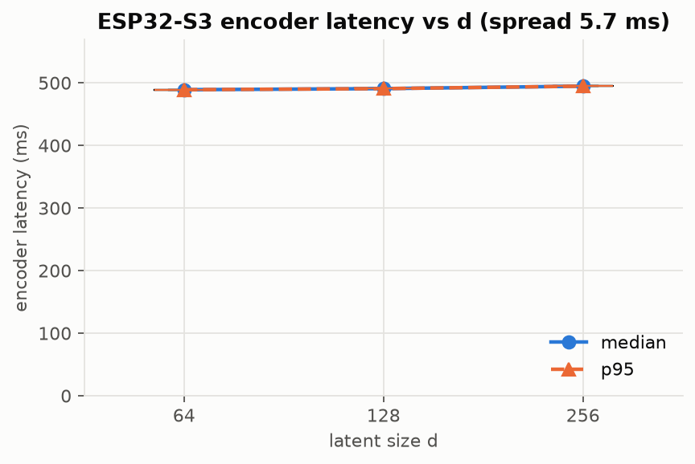
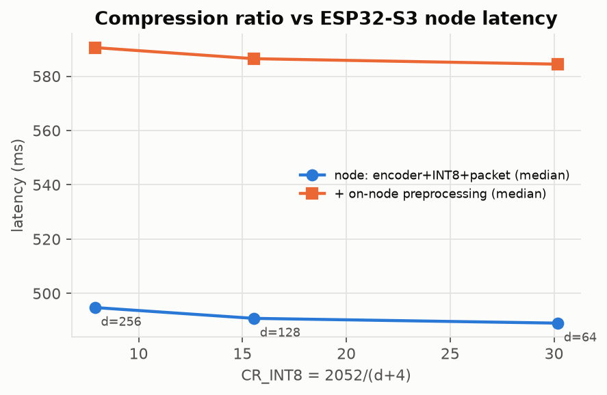
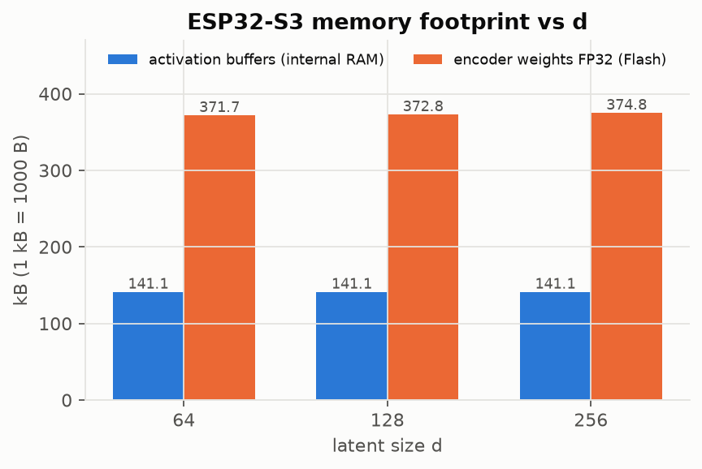

### 9.4 Tính nhất quán phần cứng và round-trip thật

Board nhận 500 recording Test của fold 1 qua USB, tạo packet thật; PC parse packet, giải lượng tử,
decode, phân loại. Hai chế độ: **L** — PC gửi log-mel (Python), board chạy encoder; **A** — PC gửi audio
int16 1 s, board tự tính STFT / mel / log / CMVN / chuẩn hoá rồi chạy encoder.

| d | chế độ | n | latent INT8 trùng Python | lệch tối đa | prediction trùng Python | accuracy (packet ESP32) |
|---|---|---|---|---|---|---|
| 64 | L | 500 | 100 % | 0 | 100 % | 41.0 % |
| 64 | A | 500 | 99.991 % | ±1 | 100 % | 41.0 % |
| 128 | L | 500 | 99.998 % | ±1 | 100 % | 47.2 % |
| 128 | A | 500 | 99.997 % | ±1 | 100 % | 47.2 % |
| 256 | L | 500 | 100 % | 0 | 100 % | 52.8 % |
| 256 | A | 500 | 99.998 % | ±1 | 100 % | 52.8 % |

Tự kiểm tra trên board (10 vector nhúng): 10/10 PASS cho cả 3 d. Mọi packet đúng d + 4 byte
(68 / 132 / 260). Accuracy từ packet ESP32 trùng hoàn toàn accuracy PyTorch của cùng fold
(fold 1 = george, chỉ một speaker nên thấp hơn trung bình 6 fold). Vài giá trị INT8 lệch ±1 do khác
biệt làm tròn float giữa board và PC, không làm đổi prediction nào. Accuracy theo chữ số từ packet ESP32
(fold 1): Phụ lục F.

Trước khi nạp, cùng mã C biên dịch trên PC cho Mức 1 trùng 100 % INT8 với PyTorch; Mức 2 sai số
log-mel tối đa 1.4 × 10⁻⁵ (trung bình 2.5 × 10⁻⁷).

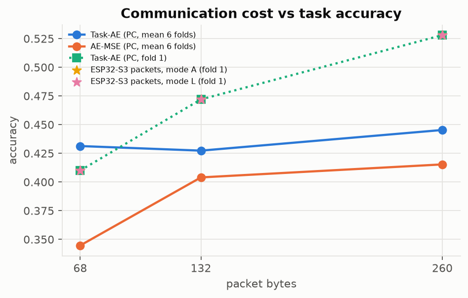

### 9.5 Phạm vi kết luận

Kết luận về: khả năng chạy (encoder + tiền xử lý chạy được trên ESP32-S3, vừa RAM nội), tốc độ
(≈ 0.49 s encoder, ≈ 0.59 s toàn node), bộ nhớ (~372 KB trọng số Flash, 141 KB RAM), payload (68–260 B,
nhỏ hơn 8196 B FP32 tới 120 lần). **Không** kết luận về năng lượng / pin / hiệu quả công suất vì không đo
dòng điện. Kiểm thử trên giả lập QEMU trước đó chỉ dùng để kiểm tra logic, không phải số đo.

## 10. Thảo luận và giới hạn

* A0 của thí nghiệm chính thấp (≈ 42–44 %) do lệch miền giữa người nói với chỉ 4 speaker Train; phương
  sai giữa speaker lớn (std ≈ 13–15 pp) → so sánh dựa trên cặp cùng fold/seed.
* Với 6 speaker, kiểm định ở mức speaker có lực thấp; ưu thế Task-AE trong thí nghiệm chính là xu hướng
  (5/6 speaker, p ≈ 0.07–0.09).
* Thí nghiệm mở rộng (classifier V2, A0 ≈ 55 %): ưu thế Task-AE ở d = 128 trên 3 seed (+2.37 pp,
  5/6 speaker, Wilcoxon p = 0.0625) tương tự thí nghiệm chính; riêng seed 0 thì không → cần nhiều seed.
* Lợi ích Task-AE phụ thuộc ngân sách byte: rõ ở 68 B, mất ở 516 B (AE-MSE tốt hơn 2.3 pp).
* Chọn λ theo Val không ổn định; lịch λ chậm cho Test tốt hơn nhưng không được Val chọn và dùng nhiều
  epoch hơn — chỉ là quan sát hậu kiểm, seed 0.
* Đặc trưng khác đề cương gốc (`log1p` → `CMVN(log(P+1e-6))`), có bằng chứng và được ghi nhận.
* Seed 1–2 chỉ ở d = 128; ablation λ, d = 512 và lịch λ chậm chỉ seed 0; phần cứng đo trên một board, một fold, encoder float32 chưa tối ưu.

## 11. Quy tắc khoa học đã tuân thủ

Không dùng Test để chọn mô hình, λ hay cấu hình; normalization chỉ từ Train; không loại mẫu khó; cùng
split và cùng classifier cho mọi phương pháp trong một fold/seed; tỷ số nén theo byte thực; lưu
prediction từng recording, config, seed, checkpoint, commit dataset; báo cáo cả kết quả không thuận lợi
(Low-Mel, ablation λ trên Val, follow-up V2). Đánh giá trên đặc trưng tái tạo không được gọi là TSTR.

## 12. Tài liệu tham khảo (PDF trong `papers/`)

1. J. Ballé, V. Laparra, E. P. Simoncelli. End-to-end Optimized Image Compression. ICLR 2017. arXiv:1611.01704.
2. L. Theis, W. Shi, A. Cunningham, F. Huszár. Lossy Image Compression with Compressive Autoencoders. ICLR 2017. arXiv:1703.00395.
3. R. Torfason, F. Mentzer, E. Agustsson, M. Tschannen, R. Timofte, L. Van Gool. Towards Image Understanding from Deep Compression without Decoding. ICLR 2018. arXiv:1803.06131.
4. A. E. Eshratifar, A. Esmaili, M. Pedram. BottleNet: A Deep Learning Architecture for Intelligent Mobile Cloud Computing Services. ISLPED 2019. arXiv:1902.01000.
5. J. Shao, J. Zhang. BottleNet++: An End-to-End Approach for Feature Compression in Device-Edge Co-Inference Systems. ICC Workshops 2020. arXiv:1910.14315.
6. J. Shao, Y. Mao, J. Zhang. Learning Task-Oriented Communication for Edge Inference: An Information Bottleneck Approach. IEEE JSAC 2022. arXiv:2102.04170.
7. N. Li, A. Iosifidis, Q. Zhang. Attention-based Feature Compression for CNN Inference Offloading in Edge Computing. ICC 2023. arXiv:2211.13745.
8. O. Iakovenko, I. Bondarenko. Convolutional Variational Autoencoders for Spectrogram Compression in Automatic Speech Recognition. 2024. arXiv:2410.02560.
9. Y. Matsubara, R. Yang, M. Levorato, S. Mandt. Supervised Compression for Resource-Constrained Edge Computing Systems. WACV 2022. arXiv:2108.11898.
10. B. Jacob et al. Quantization and Training of Neural Networks for Efficient Integer-Arithmetic-Only Inference. CVPR 2018. arXiv:1712.05877.
11. Y. Bengio, N. Léonard, A. Courville. Estimating or Propagating Gradients Through Stochastic Neurons for Conditional Computation. 2013. arXiv:1308.3432.
12. R. David et al. TensorFlow Lite Micro: Embedded Machine Learning on TinyML Systems. MLSys 2021. arXiv:2010.08678.
13. A. Paszke et al. PyTorch: An Imperative Style, High-Performance Deep Learning Library. NeurIPS 2019. arXiv:1912.01703.
14. B. McFee et al. librosa: Audio and Music Signal Analysis in Python. SciPy 2015. doi:10.25080/Majora-7b98e3ed-003.
15. Z. Jackson et al. Free Spoken Digit Dataset (FSDD). https://github.com/Jakobovski/free-spoken-digit-dataset (commit 26eb9aa).

## Phụ lục: danh sách hình (`figures/`)

| file | nội dung |
|---|---|
| dataset_samples_per_speaker.png / _per_digit.png | số recording theo speaker / digit |
| dataset_speaker_digit_matrix.png | ma trận speaker × digit |
| dataset_duration_distribution.png | phân bố thời lượng |
| dataset_length_processing.png | số file PAD / KEEP / CROP |
| waveform_examples.png | waveform minh hoạ |
| logmel_examples.png | log-mel 64×32 của 6 mẫu |
| normalization_fold1_stats.png | μ_f, σ_f của Train fold 1 |
| classifier_learning_curves.png | đường học classifier V1 |
| confusion_original.png / confusion_original_per_speaker.png | confusion matrix V1 (gộp / theo speaker) |
| baseline_reconstructions.png | tái tạo của INT8 / DCT / Low-Mel |
| ae_mse_learning_curves.png / task_ae_learning_curves.png | đường học codec d = 128 |
| ae_mse_reconstructions.png / task_ae_reconstructions.png | tái tạo qua packet INT8 thật |
| lambda_schedule.png | lịch λ |
| accuracy_vs_bytes.png | **hình chính**: accuracy theo byte |
| task_gain_by_speaker.png | Task-AE − AE-MSE theo speaker |
| mse_vs_accuracy.png | MSE vs accuracy |
| compression_vs_retention.png | CR_INT8 vs R_acc |
| accuracy_by_speaker.png | accuracy theo speaker (d = 128) |
| confusion_matrices.png | Original / Task-AE / AE-MSE d = 128 |
| lambda_ablation.png | ablation λ (Validation) |
| hw_encoder_latency_vs_d.png | ESP32-S3: latency encoder theo d |
| hw_cr_vs_latency.png | ESP32-S3: tỷ số nén vs latency node |
| hw_memory_vs_d.png | ESP32-S3: bộ nhớ theo d |
| hw_packet_bytes_vs_accuracy.png | ESP32-S3: byte packet vs accuracy (packet thật) |
| fu_classifier_search_val.png | follow-up: tìm cấu hình classifier V2 (Val) |
| fu_a0_v1_vs_v2_by_speaker.png | follow-up: A0 V1 vs V2 (trung bình 3 seed + từng seed) |
| fu_accuracy_vs_bytes_v2.png | follow-up: accuracy theo byte trên V2 (68–516 B) |
| fu_task_gain_by_speaker_v2.png | follow-up: Task-AE − AE-MSE trên V2 |
| fu_retention_v1_vs_v2.png | follow-up: R_acc main vs V2 |
| fu_lambda_val_selection_v2.png | follow-up: λ chọn theo Val vs λ = 1 |
| fu_lambda_schedule_v2.png | follow-up: lịch λ đề cương vs chậm |
